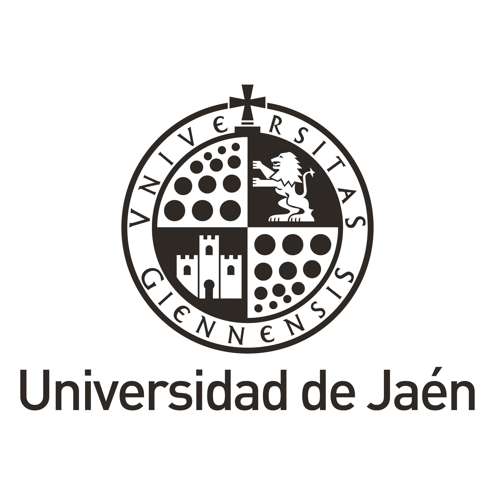

# Alfonso López Ruiz :wave:

- I'm a 25yo developer from Spain. :octocat:

- Predoctoral Fellow and Assistant Professor at the University of Jaén (Computer Graphics and Geomatics group). :mortar_board:

- BSc Computer Science (9.29) & MSc Computer Science (9.88). :page_with_curl:

- Mostly interested in GPGPU, Augmented/Virtual Reality, Particle systems, Geometric algorithms, Procedural generation and Image processing algorithms. :computer:

## Skills

 

 

 

 

 

## Work experience

**Predoctoral Fellow & Assistant professor** \
[**Spanish Ministry of Science, Innovation and Universities**](https://ujaen.es) • Contract \
Languages & Technologies: `C++`, `OpenGL`, `Python`, `Keras`, `Unity`, `OpenCV`. \
 

**Collaboration with Computer Science Department** \
[**Spanish Ministry of Science, Innovation and Universities**](https://ujaen.es) • Grant \
Languages & Technologies: `C++`, `OpenGL`, `Qt`, `OpenCV`. \
 

## Public projects

<table style="width:100%">
<tr>
    <td>
        
    </td>
    <td>
        
    </td>
</tr>
</table>

### Pinned repositories

<table style="width:100%">
<tr>
    <td>
        
    </td>
    <td>
        
    </td>
</tr>
<tr>
    <td>
        
    </td>
    <td>
        
    </td>
</tr>
<tr>
    <td>
        
    </td>
    <td>
        
    </td>
</tr>
</table>

## Contact :mailbox:

|  | 
| ---------- | ---------- |
|  | 

