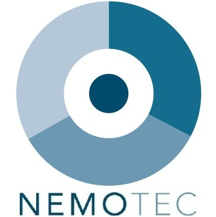
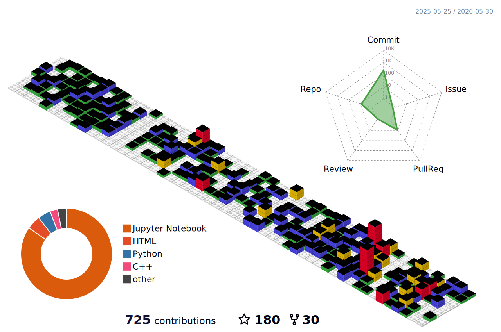

# Hi, I'm Alfonso :wave:

**Assistant Professor @ University of Zaragoza · PhD in Computer Science**

GPGPU · Photorealistic Rendering · Geometric Algorithms · Procedural Generation · Image Processing

---

## :octocat: About me

<table>
    <tr>
        <td>
            <ul>
                <li>:earth_africa: I am a 28yo developer from Spain.</li>
                <li>:mortar_board: I currently work @ University of Zaragoza as an assistant professor (before that, I was the recipient of a Juan de la Cierva Postdoc Fellowship).</li>
                <li>:page_facing_up: PhD in Computer Science (2023).</li>
                <li>:computer: Mainly interested in GPGPU, photorealistic rendering, geometric algorithms, procedural generation and image processing algorithms.</li>
            </ul>
        </td>
        <td width="220" align="center">
            
        </td>
    </tr>
</table>

<!--
## :wrench: Technologies

Operative systems 

 
Programming languages 

 
Python packages 

 
Computer Graphics frameworks and APIs 

 
Web and server frameworks/packages 

 -->

---

## :book: Work experience

<table>
    <tr>
        <td width="110" align="center">
            
        </td>
        <td>
            <strong>Assistant Professor</strong> — Department of Computer Science &amp; Engineering Systems 
            University of Zaragoza 
            Languages &amp; Technologies: <code>C++</code> <code>CUDA</code>
        </td>
    </tr>
    <tr>
        <td width="110" align="center">
            
        </td>
        <td>
            <strong>Postdoctoral Fellow (Juan de la Cierva)</strong> 
            Spanish Ministry of Science, Innovation and Universities 
            Languages &amp; Technologies: <code>C++</code> <code>CUDA</code>
        </td>
    </tr>
    <tr>
        <td width="110" align="center">
            
        </td>
        <td>
            <strong>Computer Graphics Developer</strong> 
            Nemotec Software 
            Languages &amp; Technologies: <code>C++</code> <code>VTK</code> <code>Python</code> <code>Qt</code> <code>OpenCV</code>
        </td>
    </tr>
    <tr>
        <td width="110" align="center">
            
        </td>
        <td>
            <strong>Postdoctoral Fellow (FPU)</strong> 
            Spanish Ministry of Science, Innovation and Universities 
            Languages &amp; Technologies: <code>C++</code> <code>OpenGL</code> <code>Python</code> <code>Keras</code> <code>CUDA</code> <code>OpenCV</code> <code>PyTorch</code>
        </td>
    </tr>
    <tr>
        <td width="110" align="center">
            
        </td>
        <td>
            <strong>Predoctoral Fellow (FPU)</strong> 
            Spanish Ministry of Science, Innovation and Universities 
            Languages &amp; Technologies: <code>C++</code> <code>OpenGL</code> <code>Python</code> <code>Keras</code> <code>Unity</code> <code>OpenCV</code>
        </td>
    </tr>
</table>

---

## :zap: Stats

<table>
    <tr>
        <td width="50%" align="center">
            
        </td>
        <td width="50%" align="center">
            
        </td>
    </tr>
</table>

---

## 📊 3D GitHub Contributions

