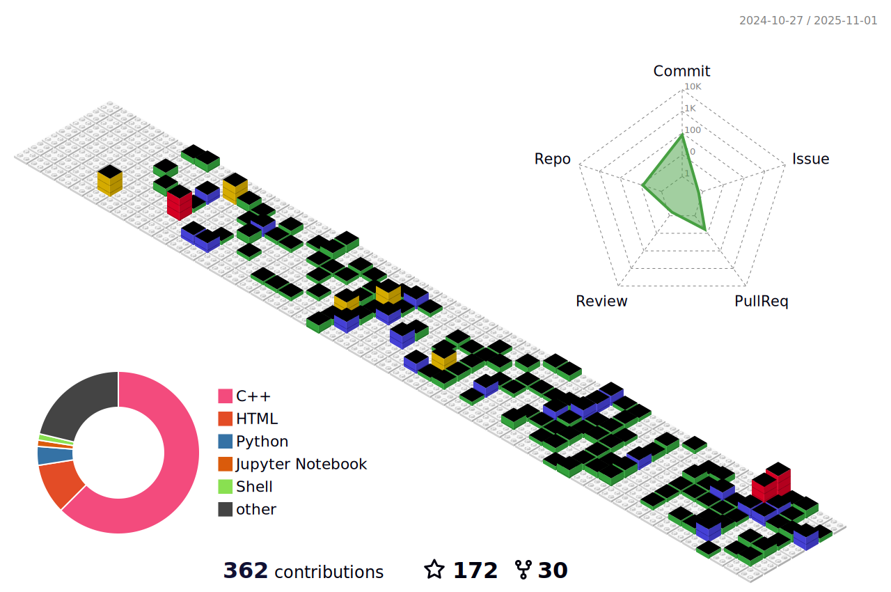

# Hi, I'm Alfonso :wave:

<table style="border:none!important;">
    <tr>
        <td style="width:80%">
            

                
- :octocat: I am a 28yo developer from Spain.
       
- :mortar_board: I am currently working @ University of Zaragoza as an assistant professor (before that, I was the recipient of a Juan de la Cierva Postdoc Fellowship).

- :mortar_board: PhD in Computer Science (2023) .

- :computer: Mainly interested in GPGPU, photorealistic rendering, geometric algorithms, procedural generation and image processing algorithms.
            

        </td>
        <td style="width:20%">
             
        </td>
    </tr>
</table>

## :mailbox: Connect with me

<!--
## :wrench: Technologies

Operative systems 

 
Programming languages 

 
Python packages 

 
Computer Graphics frameworks and APIs 

 
Web and server frameworks/packages 

 -->

## :book: Work experience

**Assistant professor (Department of Computer Science & Engineering Systems)** \
University of Zaragoza\
Languages & Technologies: `C++`, `CUDA`. \
 

**Postdoctoral Fellow (Juan de la Cierva)** \
Spanish Ministry of Science, Innovation and Universities\
Languages & Technologies: `C++`, `CUDA`. \
 

**Computer Graphics Developer** \
Nemotec Software\
Languages & Technologies: `C++`, `VTK`, `Python`, `Qt`, `OpenCV`. \
 

**Postdoctoral Fellow (FPU)** \
Spanish Ministry of Science, Innovation and Universities \
Languages & Technologies: `C++`, `OpenGL`, `Python`, `Keras`, `CUDA`, `OpenCV`, `PyTorch`. \
 

**Predoctoral Fellow (FPU)** \
Spanish Ministry of Science, Innovation and Universities \
Languages & Technologies: `C++`, `OpenGL`, `Python`, `Keras`, `Unity`, `OpenCV`. \
 

## :zap: Stats 

<table>
    <tr>
        <td style="width:50%">
            
        </td>
        <td  style="width:50%">
            
        </td>
    </tr>
</table>

## 📊 3D GitHub Contributions

